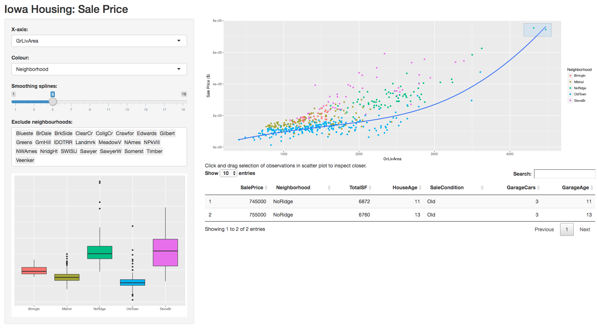
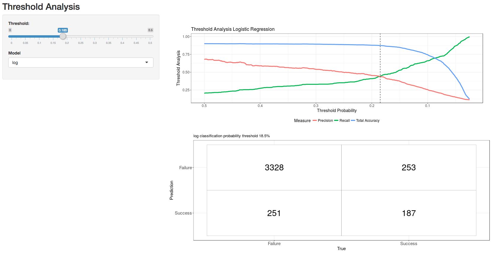

---
output:
  pdf_document:
    template: "/Volumes/Untitled/Users/Marcus/Dropbox/Skole (Selective Sync Conflict)/NHH/Master/V18/BUS464/BUS464 Vizualization in R/Term paper/svm-latex-ms.tex"
title: "Creating Dashboards with Shiny"
author:
  - name: Sebastian Navdahl,
  - name: Johannes Kolberg Krokeide,
  - name: Benjamin Aanes,
  - name: Marcus Lauritsen
    affiliation: Norwegian School of Economics
thanks: The dashboards can be run via the file dashboards.Rmd. They can also be accessed at https://bus464.shinyapps.io/houseprices/ and https://bus464.shinyapps.io/threshold/
abstract: This paper explores how interactive visualizations can be used to create dashboards. Using the shiny package, two dashboards are created. The first dashboard shows how interactive visualizations can be used for exploratory data analysis, while the second shows how interactive visualizations can be used to present the results from a machine learning classification model.
date: "`r format(Sys.time(), '%B %d, %Y')`"
geometry: margin=1in
fontfamily: mathpazo
fontsize: 12pt
spacing: onehalf
---

```{r setup, include=FALSE}
knitr::opts_chunk$set(echo = TRUE)
```
  
After working with R in a few courses, and having used base graphics and ggplot2, we wanted to explore the possibilities of interactive visualizations in the Shiny package. This is something we think might be relevant later in our careers, as interactive visualizations can give a new dimensionality to reports. Rich reports with interactive visualizations gives the reader the option to dig deeper into the data if needed. An interactive visualization can be just as simple as a normal plot, but has the possibility to be manipulated to present more or new information.

# 1. Dashboards
A dashboard uses interactive visualizations to present data. Only the most important elements are displayed, since a dashboard is limited to a single computer screen and should be easy to use. The dashboard may show the most important indicators of performance. For example, it can show the present status of a company's key performance indicators and historical trends. It should be in real-time, so the consumers of the dashboard can interact with it by filtering. A dashboard should be easy to understand, and the displayed data should be automatically updated without any assistance from the user.

# 2. Packages

## 2.1 Shiny
Shiny is a web application framework for R that makes it possible to make interactive web applications. Javascript is used to make the app interactive, CSS is used to format the user interface, and the output is displayed using HTML. As a result, a Shiny app can be run in a web browser and thus easily sharable. Also, it could be embedded in R markdown documents or displayed in RStudio.

There are two main components: a UI file (user-interface definition file) and a server script file. The UI file is the code used to set up everything the end user sees in the application like the title, sliders, plots and so on. This file is called ui.R. The second main component, the server script file, does the computational work. For example, in our shiny model we use functions like plot(), smooth() and lm(), etc. This is the instructions necessary to buid the app and the file is called server.R. Combined, ui.R and server.R can be called in a Shiny function and displayed in RStudio or a R Markdown document. Alternatively, they could be hosted on the Shiny server and accessed via the Internet.

## 2.2 ggplot2

The ggplot2 package makes it possible to create powerful and beautiful plots. It is based on the grammar of graphics, which means it follows a set of rules as a graphic language and it lets you create graphs for different types of data: univariate and multivariate, numerical and categorical. Furthermore, the package provides functions that are easy to use: the grouping of the data (group by color, symbol, size, etc.) and the creation of plots. The package creates output layer by layer. This means it is easy to overlay different things on the same plot. When doing exploratory data analysis, one can quick and easy make changes in the visualization such as changing from a bar chart to a line chart. This makes ggplot2 suitable for exploratory data analysis.

\pagebreak

# 3. Housing prices dashboard
To illustrate how interactive visualizations can be used for exploratory data analysis, we have used the Ames Housing dataset downloaded from the American Statistical Association. The dataset includes data on properties sold in Ames, Iowa. The main plot of the dashboard is a plot of the sales price against the living area of the house. 

```{r echo=TRUE, warning=FALSE}
# Load ggplot2
library(ggplot2)

# Load data
house <- read.csv('houseprices.csv')

ggplot(data = house, aes_string(x = house$GrLivArea, y = house$SalePrice)) +
  geom_point(aes_string(col = house$Neighborhood)) +
  geom_smooth(method = "lm", formula = y ~ splines::bs(x, 3), se = F) +
  labs(x = "Living area (square feet)", y = "Sale Price ($)", col = "Neighborhoods")
```

By looking at the graph, it is easy to see the positive relationship between sales price and the size of the house. However, it is very difficult to separate the neighborhoods from each other. In general, this is a plot which tries to give too much information. With static visualizations, too much information in a plot can make it look cluttered, and it is difficult to communicate the data clearly. With interactive visualizations, however, we have more opportunities. The dashboard should be able to filter neighborhoods, and click and drag a selection of observations in the scatter plot to get the raw data. An analyst, real estate agent or housing prices enthusiast should be able to dig deeper into the data. Also, box plots of the chosen neighborhoods should be displayed to give the user a quick overview of the data.

```{r echo=TRUE, message=FALSE, warning=FALSE}
library(dplyr)
library(ggplot2)

# Load data
house <- read.csv('houseprices.csv')

ggplot(data = house %>% filter(Neighborhood == "NoRidge")) +
  geom_boxplot(aes_string(x = "Neighborhood", y = "SalePrice")) +
  labs(x = "Neighborhood")
```

Moreover, it should be possible to change variables on the x-axis, so the analyst can explore what other factors affects the sales price. The color of the points could also be used for variables other than neighborhoods, for example to separate new houses from old ones. Finally, a slider for the regression line can help in the analysis of the relationship between the variables.

## 3.1 Code for creating the Shiny app

### 3.1.1 server.R

```{r server.R, echo=TRUE, message=FALSE, warning=FALSE, results='hide'}
# Load "necessary" packages
library(shiny)
library(DT)
library(readr)
library(dplyr)

# Load data
house <- read_tsv('houseprices_data.txt')

# Define server logic required to draw the plots
function(input, output) {
  output$scatterPlot <- renderPlot({
    ggplot(data = house %>% filter(!(Neighborhood %in% input$neighbourhoods)),
      aes_string(x = input$x, y = "SalePrice")) +
    geom_point(aes_string(col = input$z)) +
    geom_smooth(method = "lm", formula = y ~ splines::bs(x, input$splines), se = F) +
    labs(
      y = "Sale Price ($)"
    )
  })
  
  output$boxPlot <- renderPlot({
    ggplot(data = house %>% filter(!(Neighborhood %in% input$neighbourhoods))) +
      geom_boxplot(aes_string(x = input$z, y = "SalePrice", fill = input$z)) +
      theme(legend.position="none",
            axis.title.y=element_blank(),
            axis.text.y=element_blank(),
            axis.ticks.y=element_blank()) +
      labs(
        x = ""
      )
  })
  
  output$instructions <- renderUI({
    HTML("Click and drag selection of observations in scatter plot to inspect closer.<br>")
  })
  
  # Create data table
  output$houseTable <- DT::renderDataTable({
    brushedPoints(house, brush = input$plot_brush) %>% 
      filter(!(Neighborhood %in% input$neighbourhoods)) %>%
      select(SalePrice, Neighborhood, TotalSF, HouseAge, SaleCondition, GarageCars, GarageAge)
  })
  
}
```

\pagebreak

### 3.1.2 ui.R

```{r ui.R, echo=TRUE, message=FALSE, warning=FALSE, results='hide'}
# Load "necessary" libraries
library(shiny)
library(DT)
library(tidyverse)
library(forcats)
library(magrittr)

# Load data
house <- read_tsv('houseprices_data.txt')
names(house) <- gsub(" ", "", names(house))

# Get lists of all neighbourhoods and which to exclude by default, for plotting
house$Neighborhood = as.factor(house$Neighborhood)
all_neighbourhoods <- levels(pull(house, 'Neighborhood'))
exclude_neighbourhoods <- setdiff(levels(house$Neighborhood),
                                  c("Blmngtn", "StoneBr", "Mitchel", "OldTown", "NoRidge"))

# Define UI for application
fluidPage(
  # Application title
  titlePanel("Iowa Housing: Sale Price"),
  
  # Sidebar with various Exploratory Data Analysis choices
  sidebarLayout(
    sidebarPanel(
       # Select variable for x-axis
       selectInput(inputId = "x",
                   label = "X-axis:",
                   choices = c("GrLivArea", "TotalSF", "TotalBsmtSF", "HouseAge"),
                   selected = "GrLivArea"),
       
       # Select variable for colour
       selectInput(inputId = "z",
                   label = "Colour:",
                   choices = c("Neighborhood", "CentralAir", "MSSubClass", "SaleType",
                               "SaleCondition", "Foundation"),
                   selected = "Neighborhood"),
       
       # Select the number of smoothing splines vs. SalePrice
       sliderInput(inputId = "splines",
                   label = "Smoothing splines:", 
                   min = 1, max = 19, step = 2,
                   value = 5),
       
       # Select which neighbourhoods to exclude from the plot,
       # as it can get cluttered quickly
       selectInput(inputId = "neighbourhoods",
                   label = "Exclude neighbourhoods:",
                   choices = all_neighbourhoods,
                   selected = exclude_neighbourhoods,
                   multiple = TRUE,
                   selectize = TRUE),
       
       # Place the boxplot on the lower left side
       plotOutput(outputId = "boxPlot")
    ),
    
    # Show scatter plot and table of selected data on the right side (main area)
    mainPanel(
       plotOutput(outputId = "scatterPlot", brush = "plot_brush"),
       htmlOutput(outputId = "instructions"),
       dataTableOutput(outputId = "houseTable"),
       br()
    )
  )
)
```

{width=100%}

# 4. Threshold analysis in a classification model
Interactive visualizations can be useful when working with machine learning classifications models. To illustrate this, we have used the "Bank Marketing" dataset from the UCI Machine Learning Repository. The data is related to a direct marketing campaign for a Portuguese bank. Our goal is to predict the outcome of a sales call when a sales representative is offering a new product.

The model calculates the probability of success when calling a customer. When the probability of success reaches a set threshold, it will be classified as "success", otherwise as "failure". Consequently, it is essential to explore which threshold gives the best results.

A confusion matrix is used to evaluate the model. The matrix shows when the model gives true or false positives, and true or false negatives. Depending on the business case, different measures can be used to evaluate the model. The total accuracy, the share of correct predictions, might not be the adequate metric for a model. _Precision_ and _recall_ needs to be taken into account as well. Precision measures the share of correct predictions among the predicted successes, while recall measures the correct predictions among the successful outcomes. As seen in the plot, there is a trade-off between the two.

When the threshold slider in the dashboard is adjusted, the confusion matrix is updated and the dashed line in the plot indicates the metrics for the chosen threshold. By exploring different thresholds, the dashboard user can decide on the optimal threshold for the model.

Moreover, we can explore metrics for different models. In our case, this is logistic regression (log), linear discriminant analysis (lda), and quadratic discriminant analysis (qda).

## 4.1 Code for creating the Shiny app
### 4.1.1 server.R

```{r echo=TRUE, message=FALSE, warning=FALSE, results='hide'}
function(input, output) {
  
  load(file = "logfit.Rdata")
  
  
  output$logfit<- renderPlot({
    plot.list[[input$models]] +
      geom_vline(xintercept=input$threshold,
                 linetype = "dashed",
                 color = "black")
  })
  
  output$threshold <- renderPlot({
    confusion.matrix(table(ifelse(as.numeric(threshold.list[[input$models]] >
                                               input$threshold), 1, 0), test.data$y),
                     tit = paste0(input$models,
                                  " classification probability threshold ",
                                  input$threshold * 100, "%"))
    
  })
}
```

### 4.1.2 ui.R

```{r echo=TRUE, message=FALSE, warning=FALSE, results='hide'}
function(input, output) {
  
  load(file = "logfit.Rdata")
  
  output$logfit<- renderPlot({
    plot.list[[input$models]] +
      geom_vline(xintercept=input$threshold, linetype = "dashed",
                                           color = "black")
  })
  
  output$threshold <- renderPlot({
    confusion.matrix(table(ifelse(as.numeric(threshold.list[[input$models]] >
                                               input$threshold), 1, 0),
                                               test.data$y),
                     tit = paste0(input$models,
                                  " classification probability threshold ",
                                  input$threshold * 100, "%"))
    
  })
}
```

{width=100%}
